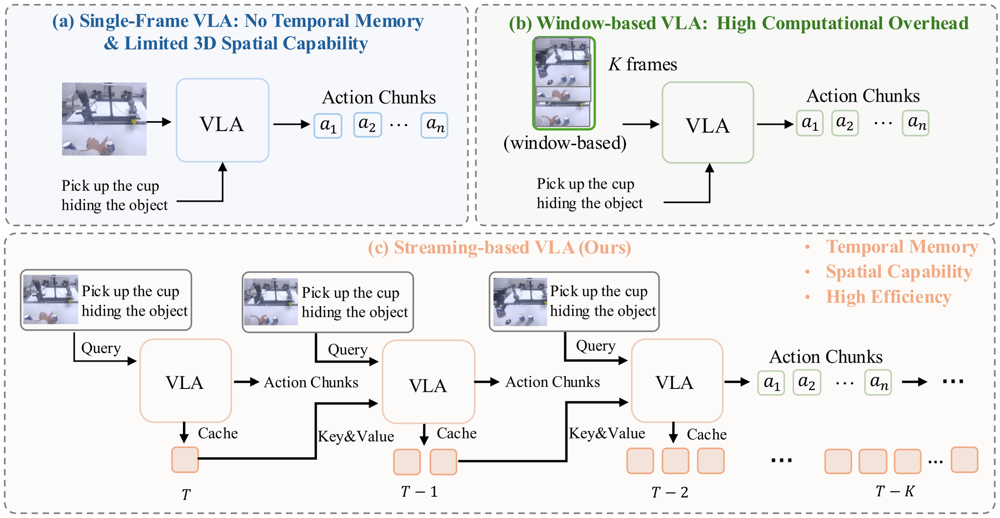

<p align="center">
  <h1 align="center">StreamPI: Streaming Multimodal Temporal Modeling for Vision-Language-Action Models</h1>
  <p align="center">
    <strong><a href="https://happinesslz.github.io/">Zhe Liu</a><sup>1*</sup></strong>
    &nbsp;&nbsp;
    <strong><a href="https://scholar.google.com/citations?user=aoqtBAsAAAAJ&hl=en">Jinghua Hou</a><sup>1*</sup></strong>
    &nbsp;&nbsp;
    <strong><a href="https://innovator-zero.github.io/">Yuxiang Lu</a><sup>1</sup></strong>
    &nbsp;&nbsp;
    <strong><a href="https://huster-yzy.github.io/">Zhenya Yang</a><sup>1</sup></strong>
    &nbsp;&nbsp;
    <strong><a href="https://www.linkedin.com/in/xianzhefan">Xianzhe Fan</a><sup>1</sup></strong>
    &nbsp;&nbsp;
    <strong><a href="https://www.linkedin.com/in/xianzhefan">Junwei Luo</a><sup>1</sup></strong>
    <br>
    <strong><a href="https://provencestar.github.io/">Junyi Li</a><sup>1</sup></strong>
    &nbsp;&nbsp;
    <strong><a href="https://scholar.google.com/citations?hl=en&user=6XibZaYAAAAJ">Ruihua Han</a><sup>1</sup></strong>
    &nbsp;&nbsp;
    <strong><a href="https://scholar.google.com/citations?user=vpjnH7AAAAAJ&hl=en">Zhi Hou</a><sup>2</sup></strong>
    &nbsp;&nbsp;
    <strong><a href="https://i.cs.hku.hk/~hszhao/">Hengshuang Zhao</a><sup>1†</sup></strong>
  </p>

  <p align="center">
    <sup>1</sup> The University of Hong Kong
    <sup>2</sup> ACE Robotics
  </p>
  <p align="center">
    <sup>*</sup> Equal contribution &nbsp;&nbsp; <sup>†</sup> Corresponding author
  </p>

  <p align="center">
  <a href="https://arxiv.org/abs/xxx"></a>
  <a href="https://happinesslz.github.io/projects/StreamPI"></a>
  </p>
</p>

This repository provides the official implementation of **StreamPI**, built on top of [openpi](https://github.com/Physical-Intelligence/openpi). We also provide the multi-node training framework in this repo.

## TL;DR

State-of-the-art Vision-Language-Action models such as $\pi_{0.5}$ process each observation independently, lacking historical context and precise spatial perception. **StreamPI** introduces streaming multimodal temporal modeling that treats every (visual observation, language instruction) pair as an atomic temporal unit. With intra-pair bidirectional attention and inter-pair causal attention, StreamPI equips single-frame VLAs with **zero-additional-parameter** temporal reasoning and supports flexible, asynchronous real-robot deployment.



[Demo]()

## 📰 News

- **Aug 30 2026**: Paper released.
- **Aug 27 2026**: Code and Model Weights released.

## ✨ Abstract

Vision-Language-Action (VLA) models have demonstrated effectiveness in robot manipulation, yet state-of-the-art models such as $\pi_{0.5}$ operate under a single-frame paradigm, limiting their ability to retain past observations and develop precise spatial perception. In this paper, we propose **StreamPI**, a streaming multimodal temporal modeling framework that equips single-frame VLA with temporal reasoning capability without introducing any additional parameters. One core design is *instruction-anchored temporal modeling*. It treats each (visual observation, language instruction) pair as an atomic temporal unit: bidirectional attention within each pair enables cross-modal fusion, while causal attention across pairs preserves autoregressive streaming inference. This ensures the language instruction serves as a persistent semantic anchor throughout task execution. To bridge the gap between synchronous training and asynchronous real-robot deployment, we introduce a *random-interval streaming training* strategy: a proper inter-frame interval (e.g., every 3 frames) enables faster and smoother action execution. Beyond this, randomizing the interval further improves robustness to frame-timing perturbations, supporting asynchronous deployment in practice. Furthermore, by leveraging the length extrapolation capability of the LLM backbone, StreamPI seamlessly inherits pretrained single-frame weights and supports flexible single-frame and multi-frame inference. Experiments on real-robot tasks spanning memory-dependent and precise perception scenarios, as well as the simulation benchmark LIBERO, demonstrate that StreamPI outperforms $\pi_{0.5}$ across diverse tasks.

## 🧠 Method

**Instruction-Anchored Temporal Modeling.** StreamPI treats each time step as an atomic temporal unit that jointly encodes multi-view visual observations and the language instruction: $\mathbf{u}_t = (\mathbf{V}_t, l_t)$. Intra-pair bidirectional attention fuses visual tokens and the instruction within each unit; inter-pair causal attention then aggregates historical fused representations autoregressively. Because the instruction is re-anchored to every observation, the model maintains persistent task awareness, and the hierarchical attention mask is implemented **without any new parameters**.

**Random-Interval Streaming Training.** Real robots produce asynchronous observation streams with variable time gaps. During training, StreamPI perturbs the base inter-frame interval with a uniform random offset, and a complementary temporal masking strategy randomly hides the earliest $k$ frames, simulating the incremental observation pattern of streaming inference. Together, these mechanisms bridge the gap between synchronous training and asynchronous deployment.

**Streaming Inference.** At the initial timestamp, the model encodes the current unit and stores its fused representation in a KV cache. At each subsequent step, only the newly arriving frame is encoded; its representation attends to cached historical representations, eliminating redundant recomputation of past frames. This keeps inference cost constant with respect to temporal horizon and makes StreamPI well-suited for long-horizon manipulation.

## 📊 Experiments

### Real-Robot Manipulation

We evaluate StreamPI on two complementary real-robot task categories: *precise perception-dependent tasks* (Cup Insertion into Cup Sleeve, Pen Insertion into Narrow Bottle) and *memory-dependent tasks* (Rolling Object Grasping, Shell Game). StreamPI substantially improves success rates over the single-frame $\pi_{0.5}$ baseline across all four tasks:

| Task                        | $\pi_{0.5}$ | StreamPI |
| --------------------------- | ----------- | -------- |
| Cup Insertion into Cup Sleeve | 60.0      | **92.0** |
| Pen Insertion into Narrow Bottle | 40.0    | **66.7** |
| Rolling Object Grasping     | 26.7        | **63.3** |
| Shell Game                  | 46.7        | **80.0** |

Success rates (%).

### LIBERO Simulation Benchmark

Success rates (%) on LIBERO. Bold denotes the best result per column. StreamPI ($T{=}5$) achieves the highest average success rate and the strongest long-horizon performance (+3.0% on LIBERO-Long over $\pi_{0.5}$).

| Method          | Spatial | Object | Goal  | Long  | Avg.  |
| --------------- | ------- | ------ | ----- | ----- | ----- |
| Diffusion Policy | 78.3   | 92.5   | 68.3  | 50.5  | 72.4  |
| Octo            | 78.9    | 85.7   | 84.6  | 51.1  | 75.1  |
| SpatialVLA      | 88.2    | 89.9   | 78.6  | 55.5  | 71.7  |
| TraceVLA        | 84.6    | 85.2   | 75.1  | 54.1  | 74.8  |
| OpenVLA         | 84.7    | 88.4   | 79.2  | 53.7  | 75.9  |
| CoT-VLA         | 87.5    | 91.6   | 87.6  | 69.0  | 81.1  |
| $\pi_0$-FAST*   | 96.4    | 96.8   | 88.6  | 60.2  | 85.0  |
| SmolVLA         | 93.0    | 94.0   | 91.0  | 77.0  | 88.8  |
| GR00T-N1        | 94.4    | 97.6   | 93.0  | 90.6  | 93.9  |
| UniVLA          | 95.4    | 98.8   | 93.6  | 94.0  | 95.4  |
| FLOWER          | 97.1    | 96.7   | 95.6  | 93.5  | 95.7  |
| CronusVLA       | 90.1    | 94.7   | 91.3  | 68.7  | 86.2  |
| TriVLA          | 91.2    | 93.8   | 89.8  | 73.2  | 87.0  |
| 4D-VLA          | 93.8    | 92.8   | 95.6  | 86.5  | 92.2  |
| CogACT          | 87.5    | 90.2   | 80.2  | 53.2  | 77.8  |
| ST-$\pi$        | 98.4    | 98.3   | 96.9  | 94.3  | 97.3  |
| MemoryVLA       | 98.4    | 98.4   | 96.4  | 93.4  | 96.5  |
| $\pi_0$         | 96.8    | 98.8   | 95.8  | 85.2  | 94.2  |
| $\pi_{0.5}$     | 98.8    | 98.2   | 96.8  | 92.4  | 96.9  |
| **StreamPI (T=3)** | 98.6 | 98.8   | 97.8  | 93.8  | 97.3  |
| **StreamPI (T=5)** | 98.4 | **99.4** | **99.2** | **95.4** | **98.3** |

### CALVIN Simulation Benchmark

Success rates (%) for completing the first through fifth task in a chained sequence on CALVIN (ABC→D), and the average number of consecutive tasks completed (Avg., out of 5). StreamPI achieves an average chain length of **4.547**, with the advantage growing as the chain progresses.

| Method             | 1     | 2     | 3     | 4     | 5     | Avg.      |
| ------------------ | ----- | ----- | ----- | ----- | ----- | --------- |
| MemoryVLA          | 94.8  | 87.4  | 81.4  | 75.9  | 69.4  | 4.090     |
| $\pi_{0.5}$        | 94.2  | 88.7  | 85.7  | 83.2  | 79.5  | 4.313     |
| **StreamPI (T=5)** | **96.9** | **93.6** | **90.7** | **88.5** | **85.0** | **4.547** |

## ⚙️ Setup

### Requirements

StreamPI follows the same requirements as openpi. Note that StreamPI stacks $T$ frame-pairs in the prefix, so memory usage grows with the temporal horizon $T$. You can use multiple GPUs with model parallelism by configuring `--fsdp-devices` (multi-node training is supported via `scripts/train_multi_node.py`).

| Mode               | FSDP | Example GPU        |
| ------------------ | --------------- | ------------------ |
| Inference          | None          | RTX 4090           |
| 3 Frames 8 GPUs | 2         | A100 (80GB) / H100 |
| 5 Frames 8 GPUs | 8         | A100 (80GB) / H100 |
| 5 Frames 32 GPUs| 4         | A100 (80GB) / H100 |

### Installation

You can refer to OpenPI to install this repo.

## 🚀 Usage

### Training Configs

StreamPI configs are defined in [`src/openpi/training/config.py`](src/openpi/training/config.py). The temporal window size $T$ is set by `Pi0Config.hist_horizon`, and the inter-frame interval by `DataConfig.hist_interval`:

| Config                       | Benchmark      | $T$ (`hist_horizon`) | Interval (`hist_interval`)                          |
| ---------------------------- | -------------- | -------------------- | --------------------------|
| `pi05_libero_stream3`        | LIBERO         | 3                    | 5       |
| `pi05_libero_stream5`        | LIBERO         | 5                    | 5       |
| `pi05_calvin_stream5`        | CALVIN         |5                    | 5       |

All stream configs fine-tune from the pretrained single-frame weights `gs://openpi-assets/checkpoints/pi05_base/params` — StreamPI introduces no new parameters, so pretrained $\pi_{0.5}$ weights are inherited directly.

### 1. Prepare Normalization Statistics

Precomputed stats are shipped in `assets/` for LIBERO and CALVIN. To recompute:

```bash
# LIBERO
bash compute_norm.sh

# CALVIN (writes to assets/pi05_calvin/.../norm_stats.json)
python compute_norm_calvin.py
```

### 2. Launch Training

Single node (see `train_stream5_calvin.sh` / `train_stream3_calvin.sh`):

```bash
JAX_DEBUG_NOWAIT=1 XLA_PYTHON_CLIENT_MEM_FRACTION=0.9 \
python scripts/train.py pi05_calvin_stream5 \
    --exp-name=pi05_stream5_calvin --resume --batch-size 256 --fsdp-devices=8
```

Multi node (see `train_stream5_calvin_4_nodes.sh` / `train_stream5_libero_4_nodes.sh`), which initialize JAX distributed from `MASTER_ADDR`/`NNODES`/`NODE_RANK` environment variables:

```bash
python -u scripts/train_multi_node.py pi05_libero_stream5 \
    --exp-name=pi05_stream5_libero_4nodes --overwrite --batch-size 256 --fsdp-devices=8
```

Checkpoints are written to `checkpoints/<config_name>/<exp-name>/<step>`.

### 3. Evaluation

#### CALVIN

See [examples/calvin/README.md](examples/calvin/README.md) for full setup. In short, start the policy server:

```bash
bash run_eval_calvin_benchmark.sh
# equivalently:
python scripts/serve_policy.py --port 8000 policy:checkpoint \
    --policy.config=pi05_calvin_stream5 \
    --policy.dir=checkpoints/pi05_calvin_stream5/pi05_stream5_calvin_4nodes/29999
```

Then run the CALVIN client in a separate CALVIN conda environment:

```bash
export CALVIN_ROOT=/path/to/calvin
bash run_calvin_env.sh
```

Results (`avg_seq_len`, per-chain success rates) are written to `{out_path}/{save_name}/result.json` and `success_rate.txt`.

#### LIBERO

See [examples/libero/README.md](examples/libero/README.md).

run `examples/libero/main.py` and `uv run scripts/serve_policy.py --env LIBERO` directly with a custom checkpoint via `policy:checkpoint --policy.config pi05_libero_stream5 --policy.dir <ckpt>`.

### Streaming Inference & Deployment

Streaming KV-cache inference requires no extra server flags: any config with `hist_horizon > 1` automatically uses the memory path in `Pi0.sample_actions`. The protocol is driven by the client:

- The client sends a `step` counter with each inference call.
- The server resets the KV cache when `step % hist_horizon == 0` (see `src/openpi/policies/policy.py`); on other steps only the new frame-pair is encoded and attends to cached history.

The CALVIN client (`examples/calvin/main.py`) implements this counter out of the box — use `--replan_steps` matching `hist_interval` (default 5). Note that the LIBERO example client currently sends a constant `step: 0`, so it exercises the full re-encoding path rather than the KV-cache path; adapt it like the CALVIN client if you want streaming inference on LIBERO.

For real-robot deployment, serve the policy with `scripts/serve_policy.py` and connect your robot client over WebSocket (see `packages/openpi-client`), sending the `step` counter as above. The `pi05_stream5_aloha_shell_game` config shows the data transforms used for our AgileX real-robot setup.

## 📖 Citation

```
@article{liu2026streampi,
  title={StreamPI: Streaming Multimodal Temporal Modeling for Vision-Language-Action Models},
  author={Liu, Zhe and Hou, Jinghua and Lu, Yuxiang and Yang, Zhenya and Fan, Xianzhe and Luo, Junwei and Li, Junyi and Han, Ruihua and Hou, Zhi and Zhao, Hengshuang},
  journal={arXiv preprint arXiv:XXXX.XXXXX},
  year={2026}
}
```

## 🙏 Acknowledgements

We thank the following repositories for their references and prior work:

- [openpi](https://github.com/Physical-Intelligence/openpi)
- [LIBERO](https://github.com/Lifelong-Robot-Learning/LIBERO)
- [CALVIN](https://github.com/mees/calvin)
